# ☁ Movim-docker

Container images for https://github.com/movim/movim based on Alpine. This repository is not part of the Movim project.

## Architecture

Movim has quite a few moving pieces. I have tried my best to encapsulate these in containers, following least responsibility and one process per container principles whenever possible.

- `web`: Nginx server. Serves static files and proxies websocket and fastcgi connections.
- `fpm`: Runs the PHP server using `php-fpm`. The `web` container connects here over FastCGI.
- `daemon`: Runs the Movim daemon, a long-running multiprocess application responsible of connecting to XMPP services and other background tasks. The `web` container also proxies websocket connections here.

Images are tagged after the Movim version they include, and these tags are mutable: Updates on the base images that carry the same Movim version will overwrite the tag. I recommend [pinning the digest](https://docs.renovatebot.com/docker/#digest-pinning) of the images when deployed in production.

The architecture of Movim is such that all three containers must share a common mountpoint. The reason for this is that both the `daemon` and the `fpm` components write static-ish files to disk, that must be served by the `web` server. Additionally, the daemon serves an API on a unix domain socket which is also created in this filesystem.

Once deployed, it looks like this:

```mermaid
flowchart TD
    Browser[🌐 Browser] --> Web

    Web --> FPM
    Web --> Daemon

    Web -- ro --> publiccache[(💾 /public/cache)]
    FPM -- rw --> publiccache
    Daemon -- rw --> publiccache

    FPM -- rw --> cache[(💾 /cache)]
    Daemon -- rw --> cache

    FPM --> DB[(🐘 Postgres)]
    Daemon --> DB

    Daemon <--> XMPP[🌈 XMPP]

    style Browser stroke-dasharray: 5
    style XMPP stroke-dasharray: 5
    style DB stroke-dasharray: 5
```

Dotted components are not part of this repository and you should provide your own.

## Deployment considerations

In addition to the images this repository provides, you will need:
- A persistent volume of some kind, made accessible to all three containers.
- A postgres database
- An XMPP server
- A `movim.env` file, made accessible to all three containers
- The `daemon` container runs database migrations on start. This is not awesome, but I haven't yet figured out a better place to do it.

### `docker-compose`

The `docker-compose.yml` file is provided as an example. That particular file builds the containers from source, but it should be possible to run the prebuilt images as well.

I do not run Movim in compose so I can provide limited help with it.

### Kubernetes

These images should work in Kubernetes. For simplicity, I run all three containers in the same pod, but perhaps it is possible to run them separately and have them share a `ReadWriteMany` PVC. I neither do not recommend this out of fear of potential interference when new versions are rolled out, but if you have tried it, let me know on an issue.

## Internals

The `web` container is based on `nginx:alpine`, and contains the Movim source tree. Despite the web server only needing access to the `public` directory in the movim source tree, this is still needed as the other containers will drop symlinks in `public` that point to other directories in the source tree.

The `fpm` and `daemon` containers include the Movim source tree and a PHP installation based on alpine. They are not, however, based on `php:alpine`, but rather on `alpine` with PHP installed via `apk`. The reason for this is that Movim requires a plethora of PHP extensions, which in the `php` images must be built from sources, pulling a massive amounts of dependencies and complicate the `Dockerfile` significantly. Alpine, however, provides packages for all the needed extensions.

Both the `fpm` and `daemon` images use `tini` as PID1, run with an unprivileged user, and should be runnable with the container rootfs in read only mode.

### Patches

A couple patches are applied to the Movim sources:
- `log-stderr.patch` patches the application so it logs to standard error, instead of a file on disk.
- `load-openssl.patch` patches the application so the php subprocesses in the `daemon` container are launched with the `openssl` extension enabled, which they require.
